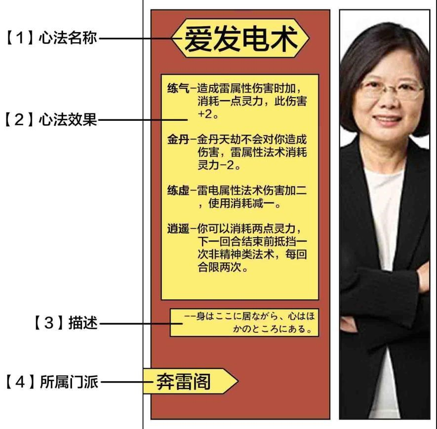
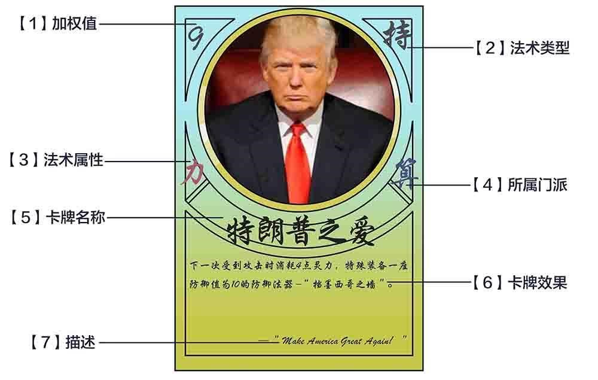
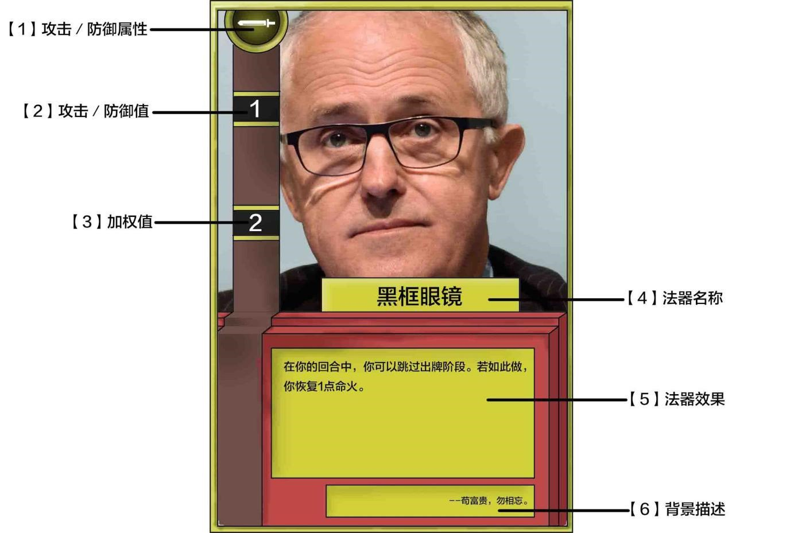

### 卡牌类型

灵犀瓶(40张以上，60张以下)：
所谓灵犀瓶，即为玩家对战时使用的摸牌堆。依照以下的规则，就能够自由组合属于个人的灵犀瓶。
-	灵犀瓶中的卡牌数必须维持在40～60张之间。
-	灵犀瓶由法术、法阵、法器、心法、万物、环境牌组成，相同名称的牌最多携带3张。
-	灵犀瓶中至少拥有一张心法牌。
-	一般来讲，灵犀瓶中的牌越少，就越容易在对战中抽到自己期望的牌。
-	你无法携带与灵犀瓶中已有的心法牌所属门派不同的卡牌。
命火标识物：	对战时角色的生命值会不停的变化，不同的情况下玩家也会拥有不同的生命值（命火）上限，因此一些用于表示玩家命火数量的道具必不可少。命火标识物是小型的火焰标记，摆在场上的数量代表命火的上限，翻面这些标识物表示失去命火，正面向上时则表示你的生命值数量。

### 卡牌区域

法阵牌区：	召唤出的法阵上场的地方。场上的法阵最多存在3张，装备满3张法阵时，召唤新法阵需要破坏场上的旧法阵来替换。
法术牌区：	所有法术发动后摆放的位置。不同的法术上场后以不同的状态表示。即时、持续法术上场后正置；触发法术上场后翻面，直至触发时正置。法术区放置的张数最多为5张，当法术区放满5张法术时，是无法释放新法术的。
修为牌区：	装备修为牌后，修为牌所处的位置。最多放置10张牌。同时，修为牌还可以作为灵力的指示物使用。
命火区（图上莫得）：一般情况下每名修士拥有10点命火上限。开始游戏时拥有10点命火，受到伤害和回复命火时相应增减命火区的命火标志物数量，当命火低于0时，如非特殊说明，则该修士输掉此局游戏。
心法牌区：	心法牌装备的位置，最多同时装备1张心法牌，正置表示。更换新的心法牌时需要摧毁旧的心法牌，并至少从修为牌区移动3张牌回到修为堆，同时回复相应数量的命火。
法器牌区：	法器装备后存在的位置，最多同时装备3张法器牌。装备满3张法器时，装备新法器需要破坏场上的旧法器来替换。
灵犀瓶：	将自己的灵犀瓶以翻面表示放置的场所。玩家在此处抽牌以补充自己的手牌。
墓地：	除修为牌以外，所有牌被破坏或被丢弃后存在的场所。
修为库：	存放所有未装备的修为牌（包括被丢弃的修为牌）的场所，由玩家双方共用。
归墟：	存放本局比赛中被封印的无定牌

### 卡牌状态

场上卡牌的表示状态
正置状态：	指该牌以正面向上表示，没有任何特殊效果。
覆盖状态：	指该牌以反面向上表示，一般情况下仅自己可以查看，但可以正常使用。
翻面状态：	指该牌以反面向上表示，一般情况下仅自己可以查看，且无法使用。
横置状态：	指该牌以正置状态顺时针旋转90°表示，一般情况下表示“已使用”。横置状态的卡牌无法再次横置。
倒置状态：	这不是一个正式状态，仅仅作为方便记忆的标记。一般耐久仅为1的法器可以处于这种状态，但是处于这种状态不一定代表耐久为1。此时横置状态改为正置状态逆时针旋转90°表示，且发动完成后立即进入墓地。

### 卡牌类型
#### 心法牌：

-	卡面信息的读法：
 
【1】心法名称：表示对应心法牌的名字。一个灵犀瓶中拥有相同名称的心法牌不能超过3张。
【2】心法效果：随着玩家等级的提升，其装备的心法牌也会逐渐获得对应的技能或效果。心法牌的重要意义就在于其战略性的技能。请详读此处的信息并理解。
【3】描述：记叙着该心法对应的科学原理。是心法相关的信息。
【4】所属门派：灵犀瓶中的每一张牌都有各自的所属门派，当玩家需要携带一张牌时，灵犀瓶中需要有至少一张与其门派对应的心法牌。
-	心法牌的定义：
心法牌是玩家游戏开始前就装备好的职业牌，是玩家自己组灵犀瓶的基础。只有装备了心法牌的玩家才可以提高自己的等级。熟练运用心法带来的技能，可以在战斗中打出巨大的效果或连锁反应。
心法牌还可以放置在灵犀瓶中，在摸牌阶段被摸入手牌。行动阶段玩家可以牺牲等级（3修为）并回满命火来装备手牌中摸到的心法牌，利用心法牌来回血，恰当使用的话可能为游戏带来意想不到的结果。

#### 基本牌：
基本牌指法术牌、法器牌、法阵牌三种卡牌的集合。上场每张基本牌有其自己需求的境界。境界需求分为练气、金丹、炼虚和逍遥，分别要求修为牌数量达到1、3、5、7才能使用。只能使用双方装备的心法对应门派的基本牌。

#### 法术牌：

-	卡面信息的读法： 
【1】加权值：以数字表示该张法术的效果强度与稀有度。数字越大则该牌越稀有，且通常越强。//饼
【2】法术类型：法术牌分为三种类型——即时法术、触发法术、持续法术。类型不同的法术拥有不一样的使用方式和登场条件。
【3】所属门派：每个法术都拥有自己的来源门派。当玩家要使用一张牌时，双方场上必须要有至少一个人装备了与之相对应的心法牌。
【4】所需境界：每个法术都有自己需求的境界。境界需求分为练气、金丹、炼虚和逍遥，分别要求修为牌数量达到1、3、5、7才能使用。
【5】卡牌名称：与心法牌的名称相同，一个灵犀瓶的同名法术最多拥有三张。
【6】法术效果：每张法术都拥有自己的特殊效果，是法术牌的主要用处。表示法术牌在触发后造成的效果。
【7】描述：对于此张法术牌背景的描述，通常都很简短。
-	法术牌的定义：
法术牌是指在行动阶段与对手展开攻防，并对对手造成伤害的牌。一般的对战都是由法术牌来进行。
法术牌的种类和功能非常多，除了提供单纯的攻击和防守以外，亦有一些法术牌拥有特殊的效果，这些效果往往能为战斗提供极大的助力。
每次使用法术牌都要做出相应的消耗，越强的法术往往消耗更多资源。每回合使用法术牌的次数没有限制。
以下是法术牌的三个类型。

【1】即时法术：即时法术是指上场后效果立刻发动的法术。在任何时间点，只要任何一张法术牌出现在玩家双方的法术牌区中，这张法术带有的效果就会立即对拥有该法术牌区的玩家生效。这种牌因为会立即发动效果所以很难反制，同时也很容易在合适的时机打出连锁的效果。即时法术的效果发动后，这张牌立刻进入墓地。
【2】触发法术：触发法术是指只有达成了特定的条件才可以发动的法术。玩家可以在行动阶段将带有触发法术标志的法术牌翻面放置在己方的法术牌区。在任何回合内，一旦该法术所要求的条件被达成，玩家可以选择立刻将这张法术恢复正置状态。一旦其正置在场上，此法术牌拥有的效果将立刻被发动，然后该牌即刻被送入墓地。触发法术是像陷阱般出其不意来谋求胜利的牌，需要依靠预测对手的行动来使用。
【3】持续法术：持续法术一旦发动便会一直留在玩家的法术牌区，每回合消耗固定的资源维持效果。持续法术没有发动效果的时机，只要该法术还留在场上，其所提供的效果便一直存在，直到这张牌离场。通常情况下，持续法术只在使用者行动阶段主动卸下或维持的资源不够时才会进入墓地。

#### 法器牌：

-	卡面信息的读法：
 
【1】加权值：以数字表示该张法器的效果强度与稀有度。数字越大则该牌越稀有，且越强。//饼
【2】所属门派：每个法器都拥有自己的来源门派。当玩家要使用一张牌时，双方场上必须要有至少一个人装备了与之相对应的心法牌。
【3】所需境界：每个法器都有自己需求的境界。境界需求分为练气、金丹、炼虚和逍遥，分别要求修为牌数量达到1、3、5、7才能使用。
【4】卡牌名称：与心法牌的名称相同，一个灵犀瓶的同名法器最多拥有三张。

【5】效果描述：记叙着该法器的装备条件和附带的效果，请仔细阅读此处，效果是法器牌的中心功能。
【6】描述：对法器牌背景故事的描述。
-	法器牌的定义：
法器牌是在行动阶段从手牌中装备于玩家法器牌区的装备牌。是玩家为战斗提供帮助的武器、防具或一切道具。
法器牌可以为玩家提供无法术牌时攻防的能力，同时为装备者提供一些持续且稳定的特殊效果。
法器牌最多同时装备三张，通常每回合只能在行动阶段装备一张。
一般情况下，法器牌一旦被装备，除非被替换或玩家自己解除，否则会一直留在场上。
除了附带的效果之外，法术牌会拥有三种属性，攻击、防御和耐久。分别如下所示：
【1】攻击：攻击法器拥有攻击值，在战斗阶段横置法器，对目标造成X（等量于攻击值）点伤害。
造成伤害：将若干命火从命火区置入公用命火堆，或将法阵的防御值在本回合等量减少的行为。这可以被某些行为阻挡，可能造成游戏结束或法阵被破坏。伤害具有属性，某些行为可能要求目标为特定属性的伤害。
【2】防御：防御法器拥有防御值，在受到攻击前横置法器，若此次攻击不大于X（等量于防御值），则抵挡此次伤害。
抵挡：对“造成伤害”行为的取消。
【3】耐久：所有法器均有耐久值。每次法器横置时，此数值将-1。若法器的耐久为0，立即将此法器下场至墓地。如果法器总耐久不大于2，建议用倒置来代表已经使用1耐久的情况。

#### 法阵牌：
-	卡面信息的读法：
【1】加权值：以数字表示该张法器的效果强度与稀有度。数字越大则该牌越稀有，且越强。//饼
【2】所属门派：每个法阵都拥有自己的来源门派。当玩家要使用一张牌时，双方场上必须要有至少一个人装备了与之相对应的心法牌。
【3】所需境界：每个法阵都有自己需求的境界。境界需求分为练气、金丹、炼虚和逍遥，分别要求修为牌数量达到1、3、5、7才能使用。
【4】防御力：防御力表示法阵的生命值，当对法阵的单次伤害大于等于这个数字时，法阵将灵力溢出崩溃进入墓地。
【5】法阵效果：法阵会提供特殊的效果，是法阵的主要功能。
【6】法阵消费：大部分法阵需要消耗灵力上场。灵力不足时无法装备法阵。某些法阵额外具有维持费用，从第二回合开始法阵于准备阶段消耗维持费用，无法支付维持费用的法阵被破坏。
【7】法阵描述：对法阵牌背景故事的描述。
【8】卡牌名称：与心法牌的名称相同，一个灵犀瓶的同名法阵最多拥有三张。
-	法阵牌的定义：
法阵牌是指被玩家消耗灵力持续维持在场上，为玩家或双方提供Buff的召唤物牌。这些牌可以为玩家提供助力，例如加快升级的过程或为玩家恢复命火。
法阵牌自身拥有名为“防御力”的生命值点数，对手造成的伤害可以作用在这些法阵上。当单回合的伤害超过这张法阵牌的防御力时，将会触发“灵力溢出”，导致这张法阵下场。
除了灵力溢出的情况，当法阵的所有者在回合结束时无法提供足量的灵力来维持法阵，这张法阵亦会进入墓地。法阵同时可以被卸下或被其他法阵替换入墓地。

#### 其他的辅助牌种：
修为牌的定义：
修为牌装备在心法上，随心法被替换而部分进入修为堆。玩家每回合都可以通过跳过摸牌回合来从修为堆中摸得一张修为牌，并在出牌回合装备。
装备后的修为牌用作表示玩家的灵力。修为牌的数量等于玩家灵力的上限，当使用灵力时，将自己的修为牌横置表示，当回复灵力时，将自己的修为牌取消横置表示。
修为牌数量影响你的等级，等级将会决定你的心法技能和灵力上限。
| 修为牌       | 等级             | 命火上限 | 灵力上限 |
| ------------ | ---------------- | -------- | -------- |
| 0            | 凡人             | 10       | 0        |
| 1            | 通天             | 10       | 1        |
| 2            | 练气（一个技能） | 10       | 2        |
| 3            | 筑基（一个技能） | 10       | 3        |
| 4            | 金丹（两个技能） | 10       | 4        |
| 5            | 元神（两个技能） | 10       | 5        |
| 6            | 练虚（三个技能） | 10       | 6        |
| 7            | 涅磐（三个技能） | 10       | 7        |
| 8-10（上限） | 逍遥（四个技能） | 10       | 8-10     |

-	万物牌的定义
万物牌是没有主动效果的特殊牌，同样被放置在灵犀瓶中。
万物牌在通常情况下仅有被动效果，而且万物牌的效果不需要上场就可以直接在手牌中触发。